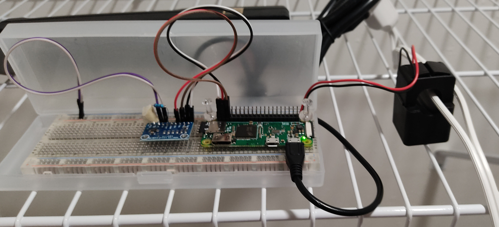

# Laundromat-Network

Currently, laundromat users don't have a way to monitor when laundry machines are available for usage.  The usual outcome is returning home with a basket full of unlaundered clothes after finding out that all machines were being used.  As a solution to this problem, we introduce the Laundromat Network Monitoring system.  The project is composed of three main parts: embedded system, server, artificial intelligence, and a user interface. 

An embedded device, controlled by a Raspberry Pi, will feature non-intrusive methods for monitoring electrical current  drawn by laundry machines in real-time.  The data will be uploaded to the cloud where analysis on power consumption will be performed.

An artificial intelligence (AI) algorithm will be designed to determine the current wash cycle of each machine, estimate when each machine will complete the job, select the best suitable laundromat locations, and recommend the best times to do laundry.

The user interface will utilize recommendations made by the AI and present them to users. The users will be given the schedules and routes to the best laundromat locations.  Statistics such as power consumption, usage, and costs will be presented in the forms of graphs for the owner to analyze. 

## Latency:
We propose to address latency in the following aspects:
* Latency analysis will be performed on real-time streaming of data between a network of embedded devices, the cloud, and user.
* Per-minute availability of machines per laundry room. 
* Tradeoff analysis between compute time and predictive power

## Parts List and Required Technology:
### Hardware:
* Raspberry Pi with internet capabilities
* Peripherals
    * ADS1115 16-bit precision ADC
* Current transformer 
    * PZCT-02 100A Split Core Current Transformer
* Resistors, breadboard, cables, soldering iron, etc. 
    * 100 Ohms resistor x 1

### Software:
* Amazon server 
* Google Maps API

## User Interface 

## System

